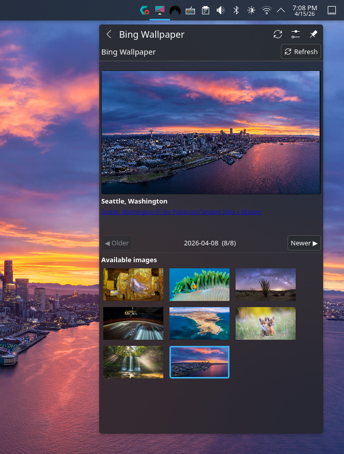
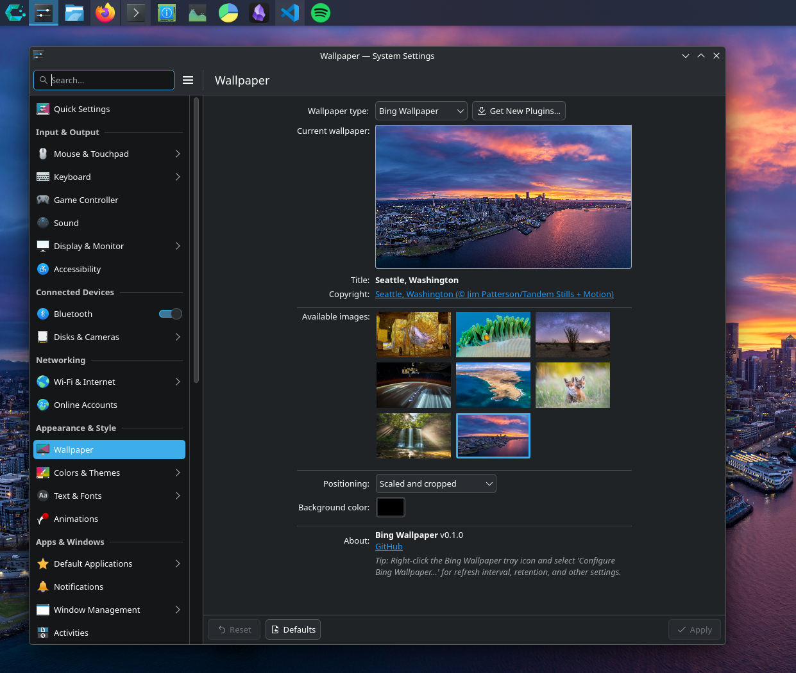

# Bing Wallpaper for KDE Plasma

A KDE Plasma 6 system tray applet and wallpaper plugin that automatically fetches and applies daily Bing wallpapers.


<a href="https://www.buymeacoffee.com/trickylf" target="_blank"></a>

<p>
  
  
</p>

## Features

- **System tray applet** — browse, preview, and switch between recent Bing wallpapers
- **Wallpaper plugin** — integrates with KDE's Desktop Settings wallpaper picker
- **Automatic updates** — fetches and applies new wallpapers daily via a systemd timer (midnight Pacific Time)
- **Multi-monitor** — applies wallpaper across all desktops
- **Image retention** — configurable limit on stored images (default: 30)
- **Right-click context menu** on the desktop with "Open Wallpaper Image" and "View on Bing" actions

## Components

| Component | Description |
|---|---|
| **System tray plasmoid** | Native Plasma applet for browsing and selecting wallpapers |
| **Wallpaper plugin** | Appears in Desktop Settings > Wallpaper > Type |
| **bing-wallpaper-helper** | Python CLI script that fetches images from Bing and applies wallpapers via D-Bus |
| **systemd timer** | Triggers daily wallpaper fetch at midnight Pacific Time (when Bing POTD wallpaper is published), with automatic catch-up on boot/wake |

## Requirements

- KDE Plasma 6.0+
- Python 3
- `qdbus6` (included with Plasma)

## Installation

### Quick install (from source)

```bash
git clone https://github.com/trickpattyFH20/kde-tray-bing-wallpaper.git
cd kde-tray-bing-wallpaper
./install.sh
```

This builds a `.plasmoid` package, installs it, and restarts plasmashell. The plasmoid is fully self-contained — on first launch it automatically sets up the systemd timer and wallpaper plugin.

### Manual install

```bash
# Build the .plasmoid package
./build-plasmoid.sh

# Install it
kpackagetool6 -t Plasma/Applet -i dist/com.github.trickpattyFH20.bingwallpaper.tray.plasmoid

# Upgrade an existing installation
kpackagetool6 -t Plasma/Applet -u dist/com.github.trickpattyFH20.bingwallpaper.tray.plasmoid
```

### Arch Linux

```bash
makepkg -si
```

### Uninstall

```bash
./uninstall.sh
```

## Configuration

Right-click the system tray icon and select **Configure Bing Wallpaper...** to access:

- **Image retention** — number of images to keep (5, 10, 30, 50, 100, or all)
- **Open folder** — browse the downloaded images directory
- **Reset database** — delete all downloaded images and start fresh

Images are stored in `~/Pictures/bing-wallpapers/`.

### Automatic scheduling

New wallpapers are fetched automatically at midnight Pacific Time each day via a systemd user timer. The timer also catches up on missed checks after boot or wake from sleep.

```bash
# Check timer status and next fire time
systemctl --user list-timers bing-wallpaper.timer

# Manually trigger a fetch
systemctl --user start bing-wallpaper.service
```

## How it works

The system tray plasmoid calls `bing-wallpaper-helper` for all backend operations:

- **`bing-wallpaper-helper fetch`** — downloads new images from the Bing API
- **`bing-wallpaper-helper set-wallpaper <path>`** — applies a wallpaper via D-Bus
- **`bing-wallpaper-helper cleanup --keep <n>`** — removes old images beyond the retention count

The wallpaper plugin integrates with KDE's desktop settings, providing right-click context menu actions and configurable fill modes.

## License

[MIT](LICENSE)
